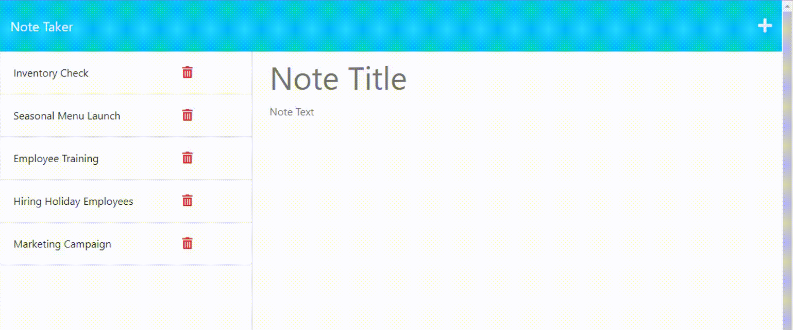

# 11-Express.js-Note-Taker-And-Task-Organizer-Application
 

## Description
An Express.js application that can be used to write, save, and delete notes. 

## Table of Contents
- [Usage](#usage)
- [License](#license)
- [Contributing](#contributing)
- [Questions](#questions)

## Usage
Link: [Note Taker and Task Organizer](https://intense-citadel-43123-3a531499351d.herokuapp.com/)

Below is the landing page.

The user should click "Get Started." The Note Taker will load with any previously saved notes.  There are five example notes saved in the application; the user can easily delete these.

To add a note, input directly into "Note Title" and "Note Text."  
As soon as the user has inputted text, a save icon will appear in the top right. Click this icon to save the task in the left column.  
If the user wishes to restart or start a new note, the + icon will clear both fields.  Also, after saving a task, the fields will automatically clear.  
If the user wants to view the details of any saved tasks, click on the task in the left column.  
(While reviewing saved tasks, if a user wants to write a new note, use the + icon.) 
Clicking the red delete icon will delete the task.

## License
[The MIT License](https://opensource.org/licenses/MIT/)

## Contributing
- BootCampSpot

## Questions
- Github: [hjlee17](https://github.com/hjlee17)